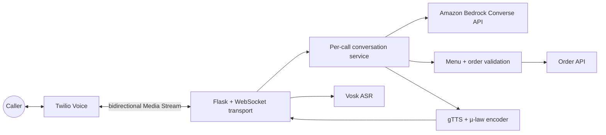

# AI Voice Ordering PoC

[](https://github.com/michael-chen-hallucination/AI_Ordering_PoC/actions/workflows/ci.yml)

A real-time phone ordering assistant that turns live speech into validated,
structured orders and spoken responses.

> **Leadership & disclosure**
>
> I served as AI Engineer Lead for a six-person team, leading the solution from
> 0→1 PoC through production delivery. This public repository contains only a
> sanitized PoC; production code, architecture, customer data, and business
> metrics are intentionally excluded.

## Why this project is technically interesting

The difficult part is not making an LLM talk about a menu. It is safely joining
a low-latency audio stream, probabilistic model output, and a downstream system
that creates a real-world side effect.

- **Streaming voice pipeline:** bidirectional Twilio Media Streams, 8 kHz µ-law
  audio, Vosk ASR, Amazon Bedrock, and text-to-speech.
- **LLM trust boundary:** model output is parsed into typed domain objects;
  unknown items and invalid quantities are rejected before any order is sent.
- **Server-authoritative pricing:** prices always come from the configured menu,
  never from generated text.
- **Concurrent call isolation:** every `streamSid` owns independent history,
  recognizer state, and submitted-order keys.
- **Safe side effects:** bounded HTTP calls and deterministic idempotency keys
  prevent accidental duplicate orders.
- **Offline verification:** the default test suite uses injected fakes and needs
  no AWS, Twilio, Vosk model, phone number, or network access.

## Architecture



### Request lifecycle

1. Twilio calls `POST /call` and receives TwiML connecting `/media` as a
   bidirectional WebSocket stream.
2. A `start` event creates isolated conversation and Vosk recognizer state.
3. Incoming µ-law frames are decoded, resampled, and incrementally transcribed.
4. After a final transcript and the configured silence window, the conversation
   service sends the call history to Bedrock's `Converse` API.
5. The model returns a short reply plus an optional JSON order. The application
   validates menu membership and quantities, then replaces all prices with
   server-owned values.
6. A complete order is submitted with a stable idempotency key. The reply is
   synthesized, converted back to 8 kHz µ-law, and streamed to the caller.
7. `stop`, disconnect, and error paths release recognizer and session resources.

## Key design decisions

| Decision | Reason |
| --- | --- |
| Bedrock `Converse` instead of a model-specific prompt API | Keeps the adapter portable across supported Bedrock chat models. |
| Explicit JSON contract plus domain validation | Treats model output as untrusted input rather than an executable command. |
| Per-call in-memory sessions | Eliminates the original global-history race while keeping this PoC easy to understand. |
| Adapter interfaces with dependency injection | Makes orchestration and failure paths deterministic in tests. |
| Server-owned menu and prices | Prevents hallucinated catalog entries and model-generated pricing from reaching the order service. |
| Idempotency key derived from call and canonical order | Makes retries safe without exposing customer text. |
| Lazy cloud and speech clients | Allows imports, health checks, and tests without credentials or a downloaded model. |

## Repository structure

```text
.
├── ai_ordering_poc.py              # Compatibility launcher
├── src/ai_ordering/
│   ├── app.py                      # Flask, Twilio, and WebSocket transport
│   ├── config.py                   # Environment-backed settings
│   ├── conversation.py             # Per-call orchestration and idempotency
│   ├── models.py                   # Menu and validated order domain
│   └── adapters/
│       ├── bedrock.py              # Structured Bedrock Converse adapter
│       ├── order_gateway.py        # Bounded, idempotent HTTP submission
│       └── speech.py               # Vosk ASR and gTTS µ-law conversion
├── tests/                           # Offline unit and boundary tests
├── .github/workflows/ci.yml         # Python 3.11/3.12 quality gate
├── .env.example                     # Safe configuration template
└── pyproject.toml                   # Package and tool configuration
```

## Quick start

### 1. Verify the core locally

Python 3.11 or 3.12 is required. The core development install deliberately does
not install Vosk, whose prebuilt wheel availability varies by platform.

```bash
git clone https://github.com/michael-chen-hallucination/AI_Ordering_PoC.git
cd AI_Ordering_PoC
python3.12 -m venv .venv
source .venv/bin/activate
python -m pip install -e ".[dev]"
pytest -q
ruff check .
```

These checks run without external services or credentials.

### 2. Install the complete voice runtime

The live voice path is best run on Linux, where Vosk publishes supported wheels.
It also needs FFmpeg for MP3 decoding:

```bash
sudo apt-get update
sudo apt-get install -y ffmpeg
python -m pip install -e ".[speech]"
```

Download an English model from the
[official Vosk model catalog](https://alphacephei.com/vosk/models), extract it
under `models/`, and set `VOSK_MODEL_PATH` to that directory. The default path
expects `models/vosk-model-small-en-us-0.15`.

### 3. Configure services

```bash
cp .env.example .env
```

Export the values from `.env` through your preferred environment manager. The
application intentionally does not load secrets from source-controlled files.

| Variable | Required for live calls | Purpose |
| --- | --- | --- |
| `AWS_REGION` | Yes | AWS region for Bedrock Runtime. |
| `BEDROCK_MODEL_ID` | Yes | A Bedrock model or inference profile that supports `Converse`. |
| `VOSK_MODEL_PATH` | Yes | Extracted local Vosk model directory. |
| `ORDER_API_URL` | Yes | HTTPS endpoint that accepts validated orders. |
| `ORDER_API_TOKEN` | No | Bearer token for the downstream order service. |
| `PUBLIC_WEBSOCKET_URL` | Recommended | Public `wss://.../media` URL; otherwise derived from the request host. |
| `SILENCE_SECONDS` | No | End-of-turn silence window; default `1.0`. |
| `REQUEST_TIMEOUT_SECONDS` | No | Downstream HTTP timeout; default `10.0`. |
| `MENU_JSON` | No | JSON object mapping menu names to prices. |
| `LOG_LEVEL` | No | Application log level; default `INFO`. |

AWS credentials follow boto3's standard credential chain and are not custom
environment variables in this project.

### 4. Run and connect Twilio

```bash
set -a
source .env
set +a
python ai_ordering_poc.py
```

Expose port `8443` through an HTTPS tunnel or deployed ingress. Configure the
Twilio phone number's incoming Voice webhook to send an HTTP `POST` to
`https://<public-host>/call`, and set `PUBLIC_WEBSOCKET_URL` to
`wss://<public-host>/media`.

Useful endpoints:

- `GET /healthz` — dependency-free process health check
- `POST /call` — Twilio Voice webhook returning bidirectional stream TwiML
- `WS /media` — Twilio Media Stream transport

## Model and order contracts

The Bedrock system prompt requires a single JSON object:

```json
{
  "message": "short spoken reply",
  "order": {
    "complete": true,
    "items": [{"name": "exact menu name", "quantity": 1}]
  }
}
```

Until an order is complete, `order` is `null`. Before submission, the domain
layer canonicalizes names, merges duplicate lines, rejects invalid quantities,
and applies menu prices. The downstream payload contains calculated line totals
and an `Idempotency-Key` header; raw transcripts are never used as that key.

## Testing and CI

The suite covers:

- configuration parsing and URL derivation
- structured model output, menu allow-listing, and pricing authority
- call-history isolation and duplicate-order prevention
- Bedrock request and response contracts
- µ-law conversion, resampling, silence handling, and lazy Vosk loading
- downstream success, timeout, and rejection paths
- Twilio start/media/stop events, malformed input, and cleanup

GitHub Actions runs Ruff and pytest on Python 3.11 and 3.12 for every push and
pull request, including an 85% minimum coverage gate. Live integration testing
is intentionally opt-in because it needs cloud credentials, a public WebSocket
endpoint, a speech model, and telephony infrastructure.

## Security and privacy

- Credentials and customer data are not committed or logged.
- Model responses are validated before triggering a downstream side effect.
- Error messages omit provider response bodies, tokens, and private endpoints.
- Audio and generated speech remain in memory; the app does not create temporary
  MP3 files.
- The order endpoint should use HTTPS outside local development.

## PoC limitations and next steps

This repository demonstrates the integration and engineering boundaries; it is
not the production system. A production implementation would additionally need
durable distributed session state, asynchronous audio/model processing,
provider-specific retry policy, authentication on internal services, tracing,
load and latency testing, human escalation, and deployment-specific controls.

The repository is provided for portfolio review. No open-source license is
granted by this repository.

## References

- [Amazon Bedrock Converse API](https://docs.aws.amazon.com/bedrock/latest/userguide/conversation-inference.html)
- [Twilio Media Streams](https://www.twilio.com/docs/voice/media-streams)
- [Vosk models](https://alphacephei.com/vosk/models)
